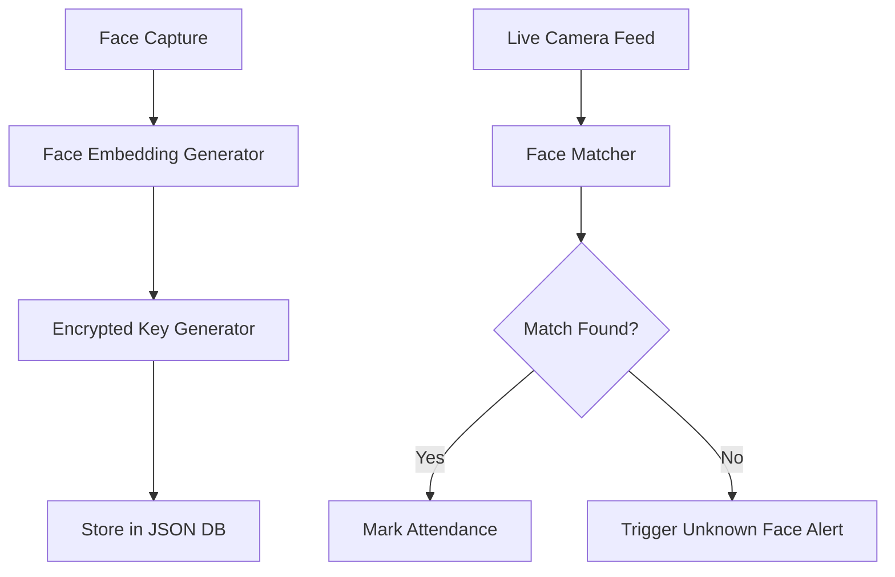

# 🛡️ AMS – Autonomous Monitoring & Supervision


---

## 📌 About the Project

> **AMS** is an advanced AI-powered system for **automated surveillance, face recognition, and attendance marking** in schools and academies.  
It transforms traditional CCTV infrastructure into an intelligent, real-time attendance and monitoring system using **face embeddings + encrypted keys**, all handled **locally** without external databases.

---

## 🚀 Key Features

- 🎥 **Live Camera Feed Grid** (Webcam + IP/RTSP support)
- 🧠 **Real-Time Face Detection & Embedding Matching**
- 🔐 **Encrypted Key Generation for Each Face**
- 🧾 **Automated Attendance Logging**
- ⚠️ **Unknown Face Alerts**
- 🗂 **JSON-based Local Data Storage**
- 📊 **Dashboard with Tabs for Monitoring, Logs, and Settings**

---

## 🧠 How It Works



---

## 📁 Project Structure

```
AMS/
├── dashboard/              # PyQt6 GUI files
├── encryption/             # Key generation logic
├── embeddings/             # Stored face encodings
├── faces/                  # Registered face images
├── logs/                   # Attendance and alerts
├── utils/                  # Helper scripts
├── main.py                 # Run this to launch dashboard
└── README.md               # Project overview
```

---

## ⚙️ Technologies Used

| Category      | Tools/Frameworks         |
|---------------|--------------------------|
| Language      | Python 3.9+              |
| GUI Framework | PyQt6                    |
| AI Library    | face_recognition, OpenCV |
| Encryption    | SHA-256, hashlib         |
| Storage       | JSON (local)             |

---

## 💻 Getting Started

### 🔧 Installation

```bash
git clone https://github.com/Kingston141/AMS.git
cd AMS
pip install -r requirements.txt
```

### ▶️ Run the Dashboard

```bash
python main.py
```

---

## 🧪 Modules Overview

| Module            | Description |
|------------------|-------------|
| **Register Face** | Capture image and register with name & register number |
| **Match Face**    | Compare real-time faces to stored encodings |
| **Live Feed**     | Monitor camera feeds from multiple sources |
| **Student DB**    | View all registered faces and details |
| **Attendance Log**| Auto-stamped log of who is present |
| **Alerts**        | View unknown face entries |
| **Settings**      | Configure camera IPs, appearance, data handling |

---

## 🔐 Encryption Logic

Each user’s face embedding, name, and register number are processed through a SHA-256 hash to create a **unique encrypted key**.  
This ensures **privacy, data integrity, and non-repetition** for consistent identity recognition.

✅ *Example structure:*

```json
{
  "encrypted_key": "a7e45f0bd89c4f...",
  "name": "Sabari Bala",
  "register_no": "22001301",
  "embedding": [...]
}
```

---

## 📊 Dashboard Preview

> *(You can add screenshots using the format below when available)*

```markdown

```

---

## 📈 Future Improvements

- ⛓ Integration with SQLite or cloud DB (optional)
- 📩 Notification on unknown alerts
- 📱 Mobile view/dashboard sync
- 🧾 PDF report generation for attendance logs

---

## 🙋‍♂️ Developed By

**Kingston J.**  
🔑 *Encryption & Face Matching Logic | AMS System Architecture*  
📫 GitHub: [@Kingston141](https://github.com/Kingston141)

---

## 📄 License

This project is licensed under the **MIT License**.  
Feel free to use, modify, or contribute!

---

## 🌟 Support the Project

If you find this project useful or inspiring:
- ⭐ Star the repo
- 🍴 Fork it
- 🛠 Raise issues or submit pull requests

> **“Automate what you can. Secure what you must. AMS is where AI meets responsibility.”**
